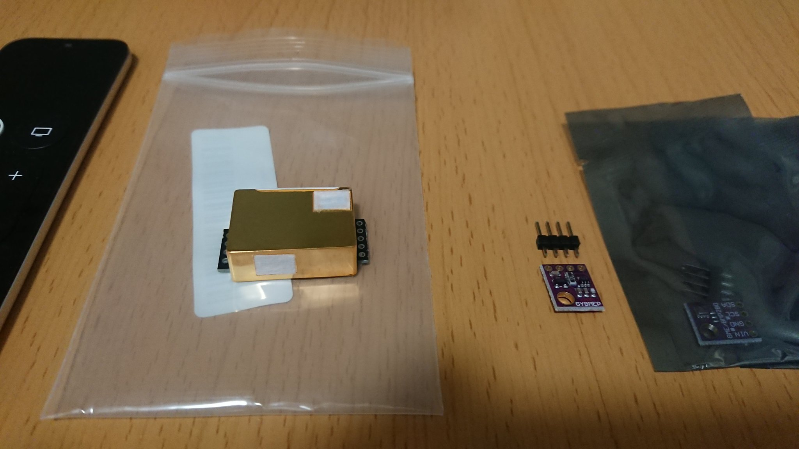

# sensor-pi

- Raspberry Pi 4とsensor類をつなげてみる

## sensor

### LaDicha MH-Z19 0-5000PPM CO2室内空気質モニタ用赤外線CO2センサUART / PWM
- 画像の金色のセンサー
- 2022/05/03購入。3899円
- https://www.amazon.co.jp/dp/B07B3VGGNL?psc=1&ref=ppx_pop_dt_b_product_details

### ACEIRMC BME280搭載 温湿度 気圧センサーモジュール 5V用 SPI I2C Arduino対応 Raspberry Pi 4個入り
- 画像の紫色のセンサー
- 2022/05/03購入。4個で5099円
- https://www.amazon.co.jp/dp/B08L6J5MLM?ref=ppx_pop_dt_b_product_details&th=1

## links
- https://github.com/nozo-moto/mhz19-bme280-go
- http://www.dododo.site/posts/raspberry-pi-4%E3%82%92lab%E3%81%AB%E3%81%99%E3%82%8B/
- https://github.com/ddddddO/embedded-using-wio_terminal