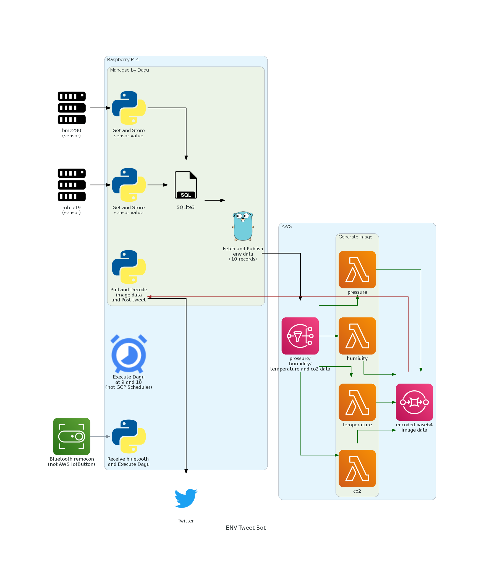
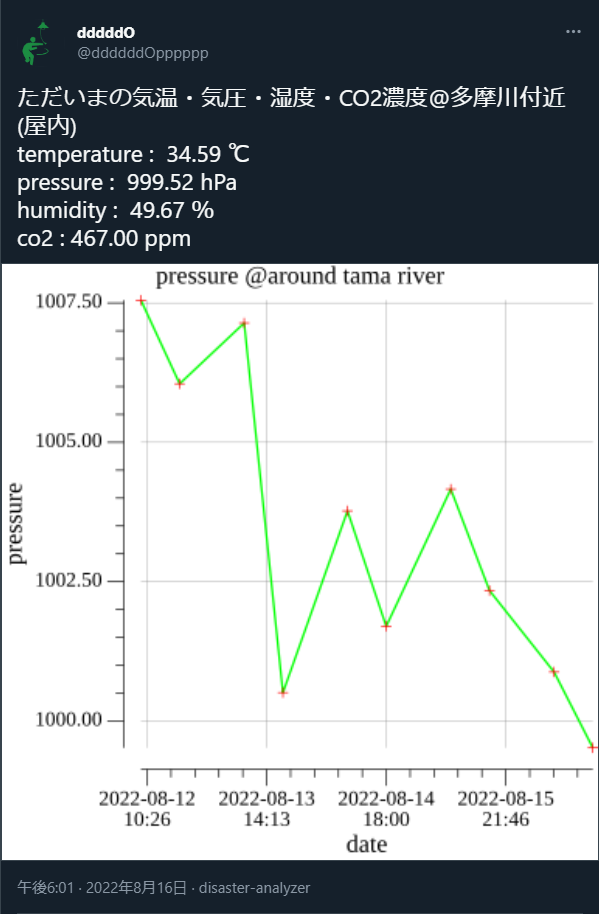
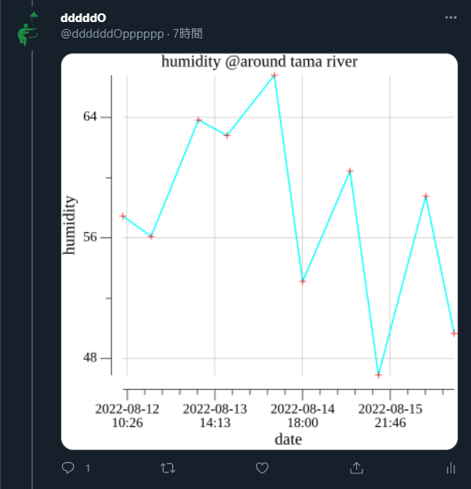
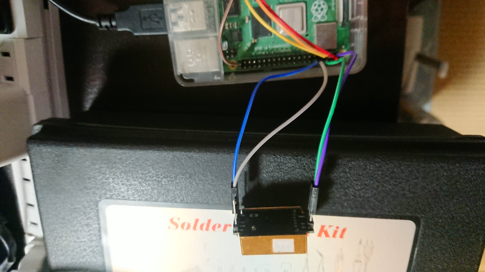
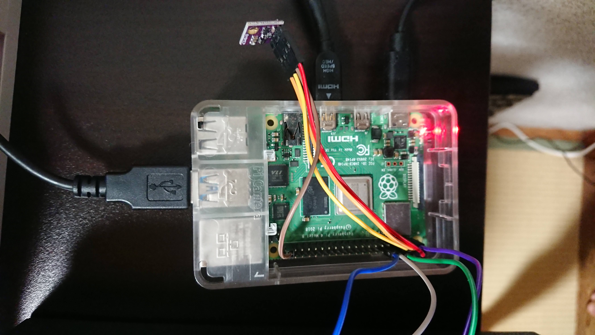
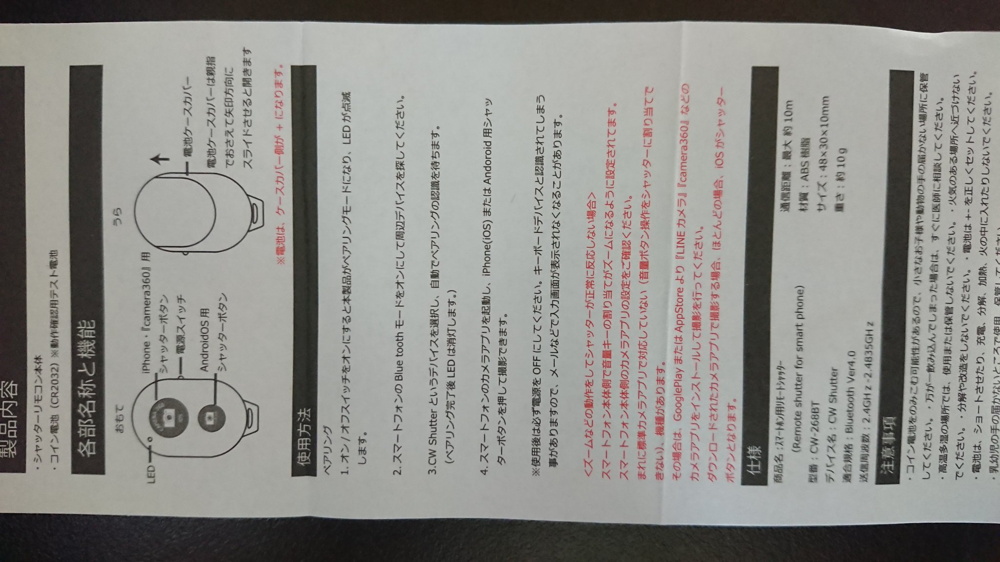

# sensor-pi

- Raspberry Pi 4とsensor類をつなげてみる

# [env-bot](env-bot/)
### 概要
- bme280から気圧・温度・湿度を、mh_z19からCO2濃度を取得する@多摩川あたり。
- 取得したデータを使って線グラフを生成する。
- 線グラフと取得データを毎日am9:00/pm6:00にツイートする。

### 構成

- [Old Architecture](env-bot/doc/README_old_architecture.md#old-architecture)
  - [repository](https://github.com/ddddddO/sensor-pi/tree/f7eba6c14cdeaad8d3a23a1c6be6b905672c27de/env-bot)
- [Next Architecture](env-bot/doc/README_next_architecture.md#next-architecture)

### 実行基盤
- cronと[**Dagu**](https://github.com/yohamta/dagu)を利用。
- 各実行コマンドの依存を[YAMLファイル](dag.yaml)に記載しDaguを実行する。
- Daguにはserverサブコマンドがあり、依存関係も視覚的に確認できる。
  - 

### Tweet

# 扱うsensor

### LaDicha MH-Z19 0-5000PPM CO2室内空気質モニタ用赤外線CO2センサUART / PWM
- 画像の金色のセンサー
- 2022/05/03購入。3899円
- https://www.amazon.co.jp/dp/B07B3VGGNL?psc=1&ref=ppx_pop_dt_b_product_details
- https://pypi.org/project/mh-z19/
  - リンク先の配線で動作確認済み
  - 

### ACEIRMC BME280搭載 温湿度 気圧センサーモジュール 5V用 SPI I2C Arduino対応 Raspberry Pi 4個入り
- 画像の紫色のセンサー
- 2022/05/03購入。4個で5099円
- 書籍で使われてるものと違うものを購入したよう。が、読み替えて利用できそう。
- https://www.amazon.co.jp/dp/B08L6J5MLM?ref=ppx_pop_dt_b_product_details&th=1
- https://github.com/nozo-moto/mhz19-bme280-go#how-to-move
  - リンク先の配線で動作確認済み
  - 

### Bluetoothリモコンシャッター
- [このツイート](https://twitter.com/sozoraemon/status/1574969255208325125?s=20&t=i2r26kbyVx00GJu13hcrzw)にインスパイアされて購入。
- ボタンを押して、その時の計測値とグラフをツイートするようにした。
- 
- 

# Links
- 「エキスパートたちのGo言語」の「Raspberry PiによるCO2、温湿度、気圧のモニタリング」p219~ をやっていく。
  - https://github.com/nozo-moto/mhz19-bme280-go
- http://www.dododo.site/posts/raspberry-pi-4%E3%82%92lab%E3%81%AB%E3%81%99%E3%82%8B/
- https://github.com/ddddddO/embedded-using-wio_terminal
- [作業風景](https://twitter.com/dddddO60664252/status/1521839460744560641?s=20&t=knhCAdHZW9eIZJTtrOVSxA)

- [raspberry pi GPIO](https://deviceplus.jp/raspberrypi/raspberrypi-gpio/)
  - 
- 「RaspberryPiで学ぶ電子工作(https://bluebacks.kodansha.co.jp/books/9784065193396/appendix/)」
  - I2C(p159~)
    - シリアル通信と呼ばれるデータ通信方式の一つ
    - I2C通信を使うと、デジタル値を出力するセンサを多数扱える
      - センサに、センサとADコンバータが内臓されているため、内部のセンサが出力するアナログ値->ADコンバータ->デジタル値出力、となるから、I2Cで扱える
    - マスター・スレーブというふうにデバイスを捉える
      - 今回なら、RaspberryPiがマスターで、BME280がスレーブ
      - スレーブにはアドレスという概念がある
    - マスター・スレーブの各デバイスは、SDAとSCLの2線で接続される
      - SDA: シリアルデータ
      - SCL: シリアルクロック
      - (本来、I2C接続にはプルアップ抵抗なるものが必要だが、RaspberryPiに内蔵されている)
    - マスター・スレーブを接続し、`i2cdetect -y 1` コマンドをマスターで実行すると、スレーブのアドレスを取得できる、と理解
      - 今回なら、`76` がBME280のアドレス
    - 各センサの仕様を確認しないと、そのセンサのアドレスや、どのレジスタ(のアドレス)からデータの読み書きをすればいいかわからない
      - [BME280のデータシート](https://ae-bst.resource.bosch.com/media/_tech/media/datasheets/BST-BME280-DS002.pdf)
        - [実装](https://github.com/nozo-moto/mhz19-bme280-go/blob/master/bme280/bme280.go)
- mh-z19を利用可能にする
  - ref: https://rcmdnk.com/blog/2021/02/18/computer-iot-raspberrypi/
  - /boot/config.txtに以下を追記しrebootする
    - `dtoverlay=disable-bt`
      - 2022/10/01 に「Bluetoothリモコンシャッター」を使いたいため、コメントアウトした。
        - そのままの状態で、uartではなくpwmで通信することで対処した。
