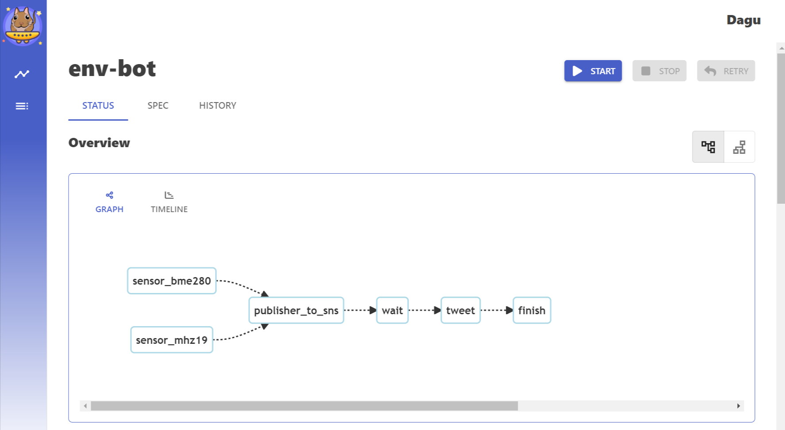

# 概要
- bme280(センサ)から気圧・温度・湿度を取得する@多摩川あたり。
- 取得したデータを使って線グラフを生成する。
- 線グラフと取得データを毎日am9:00/pm6:00にツイートする。

# データフロー

# 実行基盤
- cronと[**Dagu**](https://github.com/yohamta/dagu)を利用。
- 各実行コマンドの依存を[YAMLファイル](dag.yaml)に記載しDaguを実行する。
- Daguにはserverサブコマンドがあり、依存関係を視覚的に確認もできる。
  - 

# ツイート

